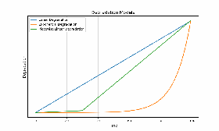

# A maradék hasznos élettartam előrejelzése az AdaBoost algoritmussal

**Olivér Hornyák1, a**

1Információtudományi Intézet, Gépészmérnöki és Informatikai Kar, Miskolci Egyetem, 3515 Miskolc-Egyetemváros, Magyarország

aoliver.hornyak@uni-miskolc.hu

**Kulcsszavak:** Maradék hasznos élettartam, Mesterséges Intelligencia, Gépi Tanulás.

## Absztrakt

A gépek és kritikus alkatrészek maradék hasznos élettartamának (RUL) előrejelzése kulcsfontosságú a proaktív karbantartás és az ipari környezetek működési hatékonysága szempontjából. Ez a tanulmány az AdaBoost algoritmus alkalmazását mutatja be a RUL előrejelzésére, amely technika iteratívan javítja az előrejelzési pontosságot azáltal, hogy a nehezen előrejelezhető esetekre összpontosít. Az AdaBoost algoritmus kiterjesztésre kerül mind bináris, mind többosztályos osztályozás kezelésére, lehetővé téve a különböző degradációs szakaszok megkülönböztetését. Az alkatrészek egészségi állapotáról részletesebb betekintést nyújtva ez a megközelítés javítja a karbantartási tervezést, lehetővé téve a célzottabb, állapotalapú beavatkozásokat. A különböző kopási szintek korai felismerése lehetővé teszi a karbantartó csapatok számára, hogy pontosan akkor ütemezzék a javításokat vagy alkatrészcseréket, amikor szükséges, csökkentve a nem tervezett leállásokat és optimalizálva az erőforrások elosztását. Ez a tanulmány bemutatja az AdaBoost alkalmazkodóképességét a komplex RUL előrejelzési forgatókönyvek kezelésében, így támogatva a hatékonyabb és adatvezérelt megközelítést az ipari alkalmazások prediktív karbantartásában.

## Bevezetés

A maradék hasznos élettartam kifejezést széles körben használják a megbízhatósági mérnöki tudományokban és a prognosztikában annak jelölésére, hogy egy eszköz vagy alkatrész várhatóan mennyi ideig fog még működni, mielőtt cserére vagy javításra szorulna. Bár a kifejezés pontos eredete nem jól dokumentált, az elmúlt évtizedekben széles körben tárgyalták az irodalomban.

Az ISO 13381-1:2004 [1] átfogó keretrendszert biztosít a prognosztikai rendszerek fejlesztéséhez és alkalmazásához a gépek állapotfigyelésében. A szabvány különbséget tesz a diagnosztika, amely az aktuális hibákat azonosítja, és a prognosztika között, amely a maradék hasznos élettartamot vagy a gépalkatrészek jövőbeli állapotát jósolja meg. Kulcsfontosságú módszertanokat vázol fel, beleértve a modellalapú, adatvezérelt és hibrid megközelítéseket, és iránymutatásokat nyújt a rendszertervezéshez, adatgyűjtéshez, jellemzők kinyeréséhez és modellvalidációhoz. Emellett teljesítménymutatókat állapít meg a prognosztikai pontosság és megbízhatóság értékelésére. A szabvány alkalmazása javítja a karbantartási tervezést, csökkenti az üzemeltetési költségeket, és növeli a rendszer biztonságát és megbízhatóságát, így elengedhetetlen referenciát jelent a prediktív karbantartás és megbízhatósági mérnöki tudományok számára.

Azonban ezek a szabványok helyesen nem hangsúlyoznak semmilyen konkrét példát tartalmuk illusztrálására. [2] célja, hogy bemutassa a meghibásodás prognosztika folyamatát, amelyet az ISO 13381-1 szabvány tartalmaz, egy elektromechanikai példán keresztül. A cél az, hogy segítse a kezdő kutatókat az ipari meghibásodás prognosztika területén a szabvány által javasolt folyamat fő feladatainak elsajátításában. A prognosztikai folyamatot választották, mert ez képviseli a kulcsfeladatot a szabvány által javasolt és publikált többi téma között. Így ennek a résznek a megértése fontos a prognosztikai módszerek és algoritmusok fejlesztéséhez a nemzetközi szabványügyi szervezet szilárd ajánlásai alapján.

A hatékony karbantartási stratégiák elengedhetetlenek az ipari rendszerek megbízhatóságának, biztonságának és hatékonyságának biztosításához [3]. Ezek a stratégiák jelentősen fejlődtek az idők során, kezdve a reaktív karbantartással, amely csak a berendezés meghibásodása után foglalkozik a problémákkal. Bár egyszerű megvalósítani, ez a megközelítés gyakran nem tervezett leállásokhoz és megnövekedett üzemeltetési költségekhez vezet. A megelőző karbantartás [4, 5] ezzel szemben előre meghatározott időközönként vagy üzemeltetési mutatók alapján ütemezi a rendszeres karbantartási tevékenységeket, függetlenül a berendezés tényleges állapotától. Bár proaktívabb, ez a stratégia még mindig szükségtelen javításokhoz és erőforrások nem hatékony elosztásához vezethet. Az állapotalapú karbantartás (CBM) kifinomultabb megközelítést vezet be azáltal, hogy valós idejű monitorozási és diagnosztikai adatokat használ a berendezés aktuális egészségi állapotának értékelésére [6]. A karbantartási intézkedéseket csak akkor hajtják végre, amikor konkrét mutatók potenciális meghibásodásokat jeleznek, ezáltal optimalizálva az erőforrások felhasználását és minimalizálva a leállásokat. Erre építve a Prognosztikai és Egészségügyi Menedzsment (PHM) képviseli a legfejlettebb karbantartási módszertant [7]. A PHM a komponensek vagy rendszerek maradék hasznos élettartamának előrejelzésére összpontosít, integrálva a diagnosztikát, prognosztikát és döntéshozó eszközöket a pontos karbantartási ütemezés lehetővé tételéhez. Ez a megközelítés nemcsak a költségeket minimalizálja, hanem növeli a rendszer megbízhatóságát és működési hatékonyságát is [8]. Ezek a stratégiák együtt demonstrálják az intelligensebb és prediktív karbantartási gyakorlatok felé való fokozatos elmozdulást.

## A prognosztikai modellek áttekintése

A fizikai alapú prognosztika egy prediktív karbantartási megközelítés, amely a rendszer vagy komponens viselkedését szabályozó alapvető fizikai elvekből származó matematikai modellekre támaszkodik. Ezek a modellek szimulálják a degradációs mechanizmusokat és meghibásodási folyamatokat, hogy előrejelezzék a maradék hasznos élettartamot vagy a rendszer jövőbeli teljesítményét meghatározott üzemeltetési feltételek mellett. A rendszer mögöttes mechanikájának, termodinamikájának vagy anyagtudományának modellezésével ez a megközelítés pontos és értelmezhető keretet biztosít a meghibásodások előrejelzéséhez. Valós idejű adatokat, például hőmérsékletet, nyomást vagy rezgést integrál ezekbe a fizikai modellekbe, hogy dinamikusan frissítse és finomítsa az előrejelzéseket. Ez a módszer különösen hatékony jól meghatározott meghibásodási módokkal rendelkező rendszerek esetében, mint például a fáradási repedésnövekedés, hődegradáció vagy kopási folyamatok.

A fizikai alapú prognosztikát gyakran alkalmazzák olyan ágazatokban, mint a repülőgépipar, autóipar és energiaipar, ahol a biztonságkritikus rendszerek pontos meghibásodási előrejelzéseket igényelnek. Jelentős előnyöket kínál, beleértve a meghibásodás gyökérokainak mélyreható megértését, a pontos karbantartási ütemezést és a kiterjedt történeti adathalmazokra való csökkentett támaszkodást. Azonban részletes szakterületi ismereteket és jelentős számítási erőforrásokat igényel a pontos modellek kidolgozásához. Lásd például a Taylor szerszámélettartam egyenletet [9]. Egyik gyakran használt formája az 1. egyenletben látható.

$$
C \cdot T = v^n \cdot f^p \cdot d^q
$$

ahol \( T \) a szerszám élettartama (perc), \( v \) a vágási sebesség (m/perc), \( f \) az előtolás (mm/fordulat), \( d \) a vágási mélység (mm), \( C \) a szerszámélettartam állandó, amely az anyagtulajdonságoktól és a vágási feltételektől függ, \( n, p, q \) pedig kísérletileg meghatározott kitevők.

Ezek ellenére a kihívások ellenére a fizikai alapú prognosztika kulcsszerepet játszik a prediktív karbantartásban, különösen, ha adatvezérelt módszerekkel kombinálják hibrid prognosztikai keretrendszerekben.

Az adatvezérelt prognosztika [10] egy fejlett megközelítés a prediktív karbantartásban, amely az adatelemzési és gépi tanulási technikákat használja a RUL vagy a gépek jövőbeli teljesítményének előrejelzésére. Ellentétben a fizikai alapú modellekkel, amelyek az alapvető fizikai jelenségek matematikai ábrázolására támaszkodnak, az adatvezérelt módszerek közvetlenül a történeti és valós idejű üzemeltetési adatokból nyernek betekintést. Ez a megközelítés különösen előnyös, ha pontos fizikai modellek nem állnak rendelkezésre, vagy a rendszer degradációs mechanizmusai túl bonyolultak ahhoz, hogy explicit módon modellezhetők legyenek.

Az adatvezérelt prognosztikában az algoritmusok elemzik az érzékelőkből és monitorozó rendszerekből gyűjtött adathalmazokat, hogy azonosítsák a közelgő meghibásodásokra utaló mintákat, trendeket és anomáliákat. Gyakran alkalmazott technikák közé tartozik a regressziós elemzés [11], neurális hálózatok [12], támogatott vektorgépek [13, 14, 15] és a mélytanulás. Ezek a módszerek lehetővé teszik a meghibásodás előfutárainak azonosítását és a RUL becslését empirikus bizonyítékok alapján.

Az adatvezérelt prognosztika ereje abban rejlik, hogy képes alkalmazkodni különböző rendszerekhez anélkül, hogy részletes szakterületi ismeretekre lenne szükség, így rendkívül sokoldalú az iparágak között. Azonban teljesítménye nagymértékben függ az adatok elérhetőségétől és minőségétől, valamint az alkalmazott algoritmusok robusztusságától. Az adatvezérelt prognosztika fejlesztését és alkalmazását elősegítette az érzékelőtechnológia, a big data analitika és a számítási teljesítmény fejlődése, így a modern prediktív karbantartási stratégiák sarokkövévé vált.

## Az AdaBoost algoritmus a RUL előrejelzésére

A boosting egy erőteljes kollaboratív tanulási technika, amelyet a gépi tanulási modellek előrejelzési teljesítményének javítására terveztek. A boosting mögötti alapötlet az, hogy több gyenge tanulót - modelleket, amelyek valamivel jobban teljesítenek, mint a véletlen találgatás - kombinál egyetlen erős tanulóvá. A boosting iteratívan működik azáltal, hogy magasabb súlyokat rendel azokhoz az adatpontokhoz, amelyeket az előző iterációkban rosszul osztályoztak, így a későbbi tanulók kénytelenek ezekre a kihívást jelentő esetekre összpontosítani.

A boosting algoritmusok tipikusan egy veszteségfüggvény minimalizálásával működnek, biztosítva, hogy az együttes modell minden iterációval javuljon. Ez az algoritmuscsalád széles körben alkalmazott mind regressziós, mind osztályozási problémákban, mivel képes kezelni az adatok összetett, nemlineáris kapcsolatait. A boosting különösen hatékony zajos vagy kiegyensúlyozatlan adathalmazok esetén, mivel szisztematikusan csökkenti a torzítást és a varianciát.

A modelleket egymás után képezik ki, minden új tanuló célja az előzőek által elkövetett hibák kijavítása. Ez a szekvenciális megközelítés biztosítja, hogy az együttes fokozatosan javítsa az általános teljesítményét azáltal, hogy azokra a területekre összpontosít, ahol a korábbi modellek küzdöttek. A boosting másik figyelemre méltó jellemzője az előrejelzések súlyozott kombinációja. A végső kimenet az összes egyéni tanuló előrejelzéseinek összesítésével származik, tipikusan súlyozott szavazási vagy átlagolási mechanizmus használatával. Ezek a súlyok tükrözik az egyes tanulók megbízhatóságát vagy pontosságát, biztosítva, hogy a megbízhatóbb modellek nagyobb befolyással bírjanak a végső döntésre. A boosting algoritmusok a nehezen osztályozható példányokra is hangsúlyt fektetnek. A képzés során azokat az adatpontokat, amelyeket a korábbi tanulók rosszul osztályoztak, magasabb súlyokkal látják el, így a későbbi tanulók kénytelenek ezekre a kihívást jelentő példákra összpontosítani. Ez a célzott tanulási stratégia segíti a modellt az adatok összetett mintáinak és kiugró értékeinek jobb kezelésében.

### Formalizálás

Az algoritmus formalizálása [16] a következő. A bemenet egy D edzés adathalmaz.

$$
D = \{(x_1, y_1), (x_2, y_2), \ldots, (x_N, y_N)\}
$$

ahol \( N \) a jellemzők száma, \( x_i \) a jellemzők és \( y_i \) a címkék

$$
y_i \in \{-1, +1\}
$$

Az algoritmus T számú iterációt hajt végre.

Az inicializálási lépésként egyenlő súlyokat rendelünk az összes edzésmintához:

$$
w_i^{(1)} = \frac{1}{N}, \quad i \in \{1, 2, \ldots, N\}
$$

For \( t = 1 \) to \( T \):

1. Lépés: Gyenge osztályozó \( h(x) \) betanítása a súlyozott adathalmazon \(\{w_i^{(t)}\}\)

2. Lépés: Számítsuk ki az osztályozási hibát \( \epsilon_t \):

$$
\epsilon_t = \frac{\sum_{i=1}^{N} w_i^{(t)} I(h(x_i) \neq y_i)}{\sum_{i=1}^{N} w_i^{(t)}}
$$

ahol \( I \) egy indikátorfüggvény:

$$
I(\text{feltétel igaz}) = 
\begin{cases} 
1, & \text{ha a feltétel igaz} \\ 
0, & \text{egyébként} 
\end{cases}
$$

3. Lépés: Számítsuk ki a gyenge osztályozó súlyát \( \alpha_t \):

$$
\alpha_t = \frac{1}{2} \ln\left(\frac{1 - \epsilon_t}{\epsilon_t}\right)
$$

4. Lépés: Frissítsük a minta súlyokat:

$$
w_i^{(t+1)} = w_i^{(t)} \exp(-\alpha_t y_i h(x_i))
$$

Normalizáljuk a súlyokat úgy, hogy

$$
\sum_{i=1}^{N} w_i^{(t+1)} = 1
$$

End For

A végső erős osztályozó a következőképpen épül fel:

$$
H(x) = \text{sign}\left(\sum_{t=1}^{T} \alpha_t h_t(x)\right)
$$

ahol

$$
\text{sign}(z) = 
\begin{cases} 
+1, & \text{ha } z > 0 \\ 
0, & \text{ha } z = 0 \\ 
-1, & \text{ha } z < 0 
\end{cases}
$$

Az AdaBoost algoritmusban azonban általában figyelmen kívül hagyjuk azt az esetet, amikor \( z = 0 \), feltételezve, hogy ez ritkán fordul elő a gyenge osztályozók súlyozása miatt.

## Az adathalmaz leírása

Ez a tanulmány a nyilvánosan elérhető "Motorok meghibásodási ideje" adathalmazt [17] használja, amely 100 motor üzemeltetési adatait tartalmazza, amelyeket folyamatosan figyeltek a meghibásodásukig. Az adathalmaz prediktív karbantartási alkalmazásokhoz készült, betekintést nyújtva a motorok teljesítményébe és meghibásodásának előrejelzésébe. Az alábbiakban az adathalmaz kulcsfontosságú attribútumai és jellemzői találhatók:

Az adathalmaz szerkezete a következőképpen részletezett:

- **ID:** Egyedi azonosító minden megfigyelt motorhoz.
- **TTF (Time to Failure):** A fennmaradó üzemeltetési idő (ciklusokban) a motor meghibásodása előtt. Ez a prediktív modellezés elsődleges célváltozója.
- **s12, s14, s17:** Szenzorleolvasások, amelyek a motor egészségének különböző aspektusait képviselik. Ezeket a jeleket a motor működése során gyűjtik.

Összesen 20 631 bejegyzés található. Az ID 1-től 100-ig terjed, ami a megfigyelt motorok számának felel meg. A TTF értékek 0-tól 361 ciklusig terjednek, átlagosan körülbelül 108 ciklussal. Az adathalmaz nem határozza meg a motor típusait, az oszlopok mértékegységeit vagy az egyes ciklusok időtartamát. A TTF erős pozitív korrelációt mutat az s12-vel (0,67) és erős negatív korrelációt az s17-tel (0,61). Mérsékelt korrelációk léteznek a TTF és az s14 (0,31), valamint az s14 és az s17 (0,25) között. Erős negatív korreláció (0,70) figyelhető meg az s12 és az s17 között.

Az alapvető változók átlag- és szórásértékei következetes szenzorleolvasásokat jeleznek, amint azt az 1. táblázat részletezi.

| Változó | Átlag | Szórás | Minimum | Maximum |
|---------|------|-------|---------|---------|
| TTF     | 107.81 | 68.88 | 0.00    | 361.00  |
| s12     | 521.41 | 0.74  | 518.69  | 523.38  |
| s14     | 8143.75 | 19.08 | 8099.94 | 8293.72 |
| s17     | 393.21 | 1.55  | 388.00  | 400.00  |

**1. táblázat: Leíró statisztikák**

Az adathalmaz teljes, nincs hiányzó érték jelentve egyetlen oszlopban sem. Szimmetrikus eloszlások figyelhetők meg a szenzorjelek (s12, s14, s17) esetében, ami azt sugallja, hogy az adathalmaz jól alkalmazható prediktív modellezésre. A szenzorleolvasások és a TTF hisztogramjai normál és enyhén ferde eloszlások keverékét mutatják, a TTF jobbra ferde eloszlást mutat.

## Degradációs modellek

Ebben a tanulmányban három degradációs modellt vizsgáltunk.

1. **Lineáris Degradációs Modell**, amely feltételezi, hogy a degradáció állandó ütemben halad előre az idővel.

   $$ D(t) = D_0 + \alpha t $$

   ahol \( D(t) \): Degradáció \( t \) időpontban, \( D_0 \) az induló állapot vagy kezdő degradáció, \( \alpha \) az állandó degradációs ráta, \( t \) az idő.

2. **Exponenciális Degradációs Modell**, amely gyorsított degradációt képvisel, ahol a degradáció üteme idővel növekszik.

   $$ D(t) = D_0 e^{\beta t} $$

   ahol \( \beta \) a degradáció növekedési üteme.

3. **Darabos Lineáris Degradációs Modell**, amely több lineáris modellt kombinál, hogy a rendszerek különböző üzemeltetési fázisokban változó degradációs ütemeit képviselje.

   $$ 
   D(t) = 
   \begin{cases} 
   D_0 + \alpha_1 t, & \text{ha } t \leq t_1 \\
   D(t_1) + \alpha_2 (t - t_1), & \text{ha } t > t_1 
   \end{cases}
   $$

   ahol \( t_1 \) az átfordulási idő.

A degradáció időbeli alakulását az 1. ábra szemlélteti.

Referenciamodellként egy bináris osztályozást használtunk, amelyet [18] publikáltak. Két címkét hoztunk létre: a mediánnál kisebb TTF értékekkel rendelkező mintákat 1-gyel (magas kockázat), a mediánnál nagyobb vagy egyenlő értékekkel rendelkezőket pedig 0-val (alacsony kockázat) jelöltük.

## A degradációs modellek osztályozási eredményei

A lineáris, exponenciális és darabos lineáris degradációs modellek osztályozási teljesítményét standard metrikák, köztük a pontosság, precizitás, visszahívás és F1 pontszám alapján értékeltük. Minden modellt alkalmaztunk az adathalmazra a meghibásodási idő (TTF) osztály előrejelzésére, az eredményeket az alábbiakban foglaljuk össze.

A lineáris degradációs modell 51,9%-os pontosságot ért el, a precizitás és visszahívás értékei 50,5% és 52,5% voltak. Az F1 pontszám, amely a precizitás és visszahívás egyensúlyát méri, 51,5% volt. Ezek az eredmények mérsékelt képességet jeleznek a TTF helyes osztályozására, kissé jobb, mint a véletlen találgatás.

Összehasonlításképpen, az exponenciális degradációs modell kevésbé hatékonyan teljesített, 51,4%-os pontossággal és 4,6%-os F1 pontszámmal. Míg a precizitása 49,3% volt, a visszahívás jelentősen alacsonyabb, 2,4% volt, ami jelentős korlátot jelez a valódi pozitív esetek azonosításában.

A darabos lineáris degradációs modell a három modell közül a legjobb teljesítményt mutatta, 52,1%-os pontossággal, 50,6%-os precizitással és 52,8%-os visszahívással. Az 51,7%-os F1 pontszám enyhe javulást tükröz a lineáris modellhez képest, jelezve a precizitás és visszahívás közötti kissé jobb egyensúlyt.

Ezek az eredmények kiemelik a degradációs modellezési megközelítés további fejlesztésének szükségességét, például a jellemzők kiválasztásának javításával, a modellparaméterek finomhangolásával és fejlettebb prediktív modellek beépítésével, hogy magasabb osztályozási teljesítményt érjünk el.

Amint látható, a bináris osztályozási modellek mindhárom degradációs modellt felülmúlták.

| Referencia | Lineáris Degradáció | Exponenciális Degradáció | Darabos Lineáris Degradáció |
|------------|---------------------|--------------------------|-----------------------------|
| Pontosság  | 0.801               | 0.519                    | 0.514                       | 0.520                       |
| Precizitás | 0.830               | 0.504                    | 0.493                       | 0.506                       |
| Visszahívás| 0.742               | 0.524                    | 0.023                       | 0.527                       |
| F1 Pontszám| 0.783               | 0.514                    | 0.045                       | 0.516                       |

**2. táblázat: AdaBoost teljesítmény**

## Következtetések

A referenciamodell jelentősen felülmúlja mindhárom alternatív modellt - lineáris degradáció, exponenciális degradáció és darabos lineáris degradáció - a pontosság, precizitás, visszahívás és F1 pontszám tekintetében. A 80,1%-os pontossággal a referenciamodell képes helyesen előrejelezni az esetek többségét, szemben az alternatív modellekkel, amelyek körülbelül 51-52%-os pontosságot érnek el. Hasonlóképpen, a referenciamodell precizitása (83,0%), visszahívása (74,2%) és F1-pontszáma (78,3%) kiegyensúlyozott teljesítményt jelez, kiválóan azonosítva a valódi pozitív eseteket és elkerülve a hamis pozitívokat.

A darabos lineáris modell, bár a degradációs modellek közül a legjobb teljesítményt nyújtja, még mindig elmarad a referenciamodelltől, különösen a precizitás (50,6%) és visszahívás (52,7%) tekintetében. A lineáris degradációs modell hasonló metrikákat kínál a darabos lineáris modellhez, de hiányzik az alkalmazkodóképessége az összetett viselkedések megragadásához, amit az alacsonyabb F1-pontszám (51,4%) tükröz. Az exponenciális degradációs modell a leggyengébb teljesítményt mutatja, 4,5%-os F1-pontszámmal, elsősorban az alacsony visszahívás (2,3%) miatt, ami kiemeli a valódi pozitív esetek megbízható észlelésének képtelenségét.

Összességében az összehasonlítás aláhúzza a referenciamodell robusztusságát az adathalmaz hatékony kezelésében, míg a degradációs modellek, különösen az exponenciális modell, jelentős fejlesztéseket igényelnek, hogy elérjék a prediktív teljesítményét.

A degradációs modellek teljesítményének javítására irányuló jövőbeli fejlesztések több kulcsstratégia révén közelíthetők meg. Először is, a jellemzők mérnöki tervezése alkalmazható további jelentős jellemzők beépítésére. Származtatott metrikák, mint például az érzékelő leolvasások változási üteme, a kumulatív degradáció vagy a gördülő átlagok hozzáadhatók. Ezenkívül a szakterületi betekintések segíthetnek olyan jellemzők kinyerésében, amelyek közvetlenül megragadják a valós motor degradációs viselkedését, növelve a modellek alkalmazásra való relevanciáját.

A fejlett modellfejlesztés egy másik lehetőséget kínál a javulásra. Hibrid modellek, amelyek integrálják a fizikai alapú degradációs elméleteket a gépi tanulási megközelítésekkel, egyensúlyt biztosíthatnak az elméleti megértés és az empirikus adatok adaptációja között. Ezenkívül időbeli sorozatmodellek, mint például a Long Short-Term Memory (LSTM) hálózatok vagy a Temporal Convolutional Networks (TCN-k), alkalmazhatók az adatok szekvenciális természetének hatékonyabb kezelésére. Az együttes módszerek, beleértve a Random Forests, a Gradient Boosting Machines vagy az XGBoost, szintén felfedezhetők a klasszifikációs pontosság és robusztusság javítása érdekében.

A modellek optimalizálása elengedhetetlen a jobb eredmények eléréséhez. A hiperparaméterek finomhangolása, különösen a degradációs modellek esetében (pl. paraméterek, mint \( \beta \), vagy darabos küszöbök beállítása), finomhangolhatja a modell teljesítményét. Keresztvalidációs módszerek, mint például a k-szeres keresztvalidáció, alkalmazandók a modellek megbízhatóságának biztosítása és a túltanulás minimalizálása érdekében.

Az adathalmaz osztályegyensúlyának kezelése javíthatja a modell érzékenységét és specifitását.

## Köszönetnyilvánítás

A leírt cikk a 2020-1.1.2-PIACI-KFI-2020-00147 OmegaSys Élettartam tervezési és meghibásodás előrejelzési döntéstámogató rendszer létesítménygazdálkodási szolgáltatásokhoz projekt keretében valósult meg, amelyet a Nemzeti Kutatási, Fejlesztési és Innovációs Alap támogatásával hajtottak végre, a 2020.1.1.2-PIACI KFI finanszírozási program keretében.

## Hivatkozások

[1] International Organization for Standardization (ISO), ISO 13381-1:2004  Condition Monitoring and Diagnostics of Machines  Prognostics  General Guidelines, ISO, Geneva, 2004.

[2] D.A. Tobon-Mejia, K. Medjaher, N. Zerhouni, The ISO 13381-1 standard's failure prognostics process through an example, 2010 Prognostics and System Health Management Conference, 2010, pp. 1-12.

[3] M. Baur, P. Albertelli, M. Monno, A review of prognostics and health management of machine tools, The International Journal of Advanced Manufacturing Technology, vol. 110, no. 5-6, pp. 1417-1438, 2020. https://doi.org/10.1007/s00170-020-05202-3

[4] M. Ben-Daya, S.O. Duffuaa, A. Raouf, J. Knezevic, D. Ait-Kadi (Eds.), Handbook of Maintenance Management and Engineering, Springer, London, 2009. https://doi.org/10.1007/978-1-84882-472-0

[5] E.I. Basri, I.H. Abdul Razak, H. Ab-Samat, S. Kamaruddin, Preventive maintenance (PM) planning: a review, Journal of Quality in Maintenance Engineering, vol. 23, pp. 114-143, 2017.

[6] A.K.S. Jardine, D. Lin, D. Banjevic, A review on machinery diagnostics and prognostics implementing condition-based maintenance, Mechanical Systems and Signal Processing, vol. 20, pp. 1483-1510, 2006.

[7] M. Kordestani, M.E. Orchard, K. Khorasani, M. Saif, An overview of the state of the art in aircraft prognostic and health management strategies, IEEE Transactions on Instrumentation and Measurement, vol. 72, pp. 1-15, 2023.

[8] C. Li, S. Li, Y. Feng, K. Gryllias, F. Gu, M. Pecht, Small data challenges for intelligent prognostics and health management: a review, Artificial Intelligence Review, vol. 57, no. 8, pp. 214, 2024.

[9] F.W. Taylor, On the art of cutting metals, vol. 23, American Society of Mechanical Engineers, 1906.

[10] A. Mosallam, K. Medjaher, N. Zerhouni, Data-driven prognostic method based on Bayesian approaches for direct remaining useful life prediction, Journal of Intelligent Manufacturing, vol. 27, pp. 1037-1048, 2014.

[11] A. Tayade, S. Patil, V. Phalle, F. Kazi, S. Powar, Remaining useful life (RUL) prediction of bearing by using regression model and principal component analysis (PCA) technique, Vibroengineering Procedia, vol. 23, pp. 30-36, 2019.

[12] Z. Kang, C. Catal, B. Tekinerdogan, Remaining useful life (RUL) prediction of equipment in production lines using artificial neural networks, Sensors, vol. 21, no. 3, p. 932, 2021.

[13] A. Widodo, B.S. Yang, Machine health prognostics using survival probability and support vector machine, Expert Systems with Applications, vol. 38, no. 7, pp. 8430-8437, 2011.

[14] C. Louen, S.X. Ding, C. Kandler, A new framework for remaining useful life estimation using support vector machine classifier, in: 2013 Conference on Control and Fault-Tolerant Systems (SysTol), IEEE, Oct. 2013, pp. 228-233.

[15] L. Zhang, Z. Liu, D. Luo, J. Li, H.Z. Huang, "Review of remaining useful life prediction using support vector machine for engineering assets," in: 2013 International Conference on Quality, Reliability, Risk, Maintenance, and Safety Engineering (QR2MSE), IEEE, July 2013, pp. 1793-1799.

[16] Y. Freund, R.E. Schapire, A Decision-Theoretic Generalization of On-Line Learning and an Application to Boosting, Journal of Computer and System Sciences, 55 (1) (1997) 119139. DOI:10.1006/jcss.1997.1504

[17] https://www.kaggle.com/datasets/m0ntecarl0/engine-time-to-failure

[18] O. Hornyk, Data-Driven Engine Health Monitoring with AI. Eng. Proc. 2024, 79, 39. https://doi.org/10.3390/engproc2024079039
